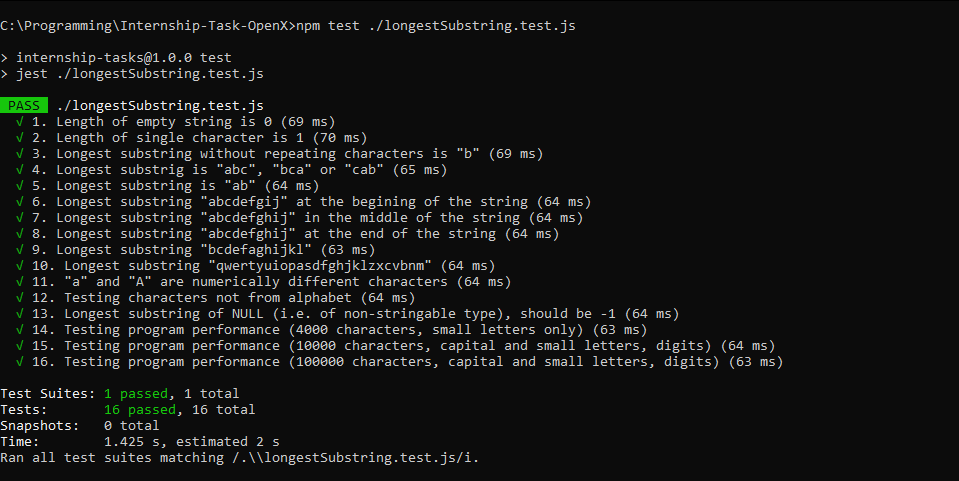
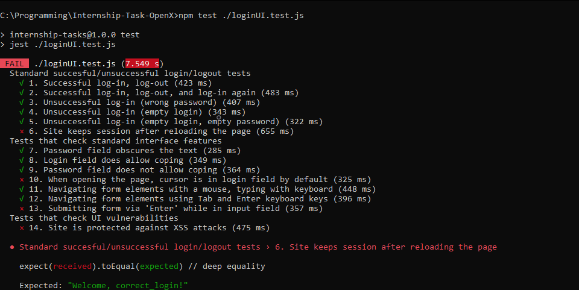

# Internship-Task-OpenX

## Repository Descrition

Repository contains files with solution to recruitment tasks given in the file [OpenX - internship tasks (QA, Js).pdf](Internship-Task-OpenX/OpenX%20-%20internship%20tasks%20(QA,%20Js).pdf)

## Task 1.
Testcases can be found in [testDataset.json](Internship-Task-OpenX/testDataset.json) JSON file. Each test case follow the pattern:
+ **input** - here can be found string that will be tested
+ **output** - provides correct answer for given input
+ **explanation** - gives explanation to the test case, tells what is tested

Furthermore, the JavaScript file [longestSubstring.js](Internship-Task-OpenX/longestSubstring.js) provides algorythm that finds the length of the longest substring without repeating characters. File [longestSubstring.test.js](Internship-Task-OpenX/longestSubstring.test.js) allows to test the algorythm using the dataset with provided test cases. It uses Jest as a testing module.

## Task 2.
Testing [sample login UI](http://uitestingplayground.com/sampleapp) is done in [loginUI.test.js](Internship-Task-OpenX/loginUI.test.js). As a testing framework it also uses Jest. Additionally it uses Puppeteer module to automatically navigate the page.

## Running the tests
1. First you need to have Node.js installed (for example from [here](https://nodejs.org/en/download)).
2. Open command line, go to the project folder and run: 
```
npm install
```
This will install all the dependencies that are used in the project.

3. Running tests from the Task 1:
```
npm test ./longestSubstring.test.js
```
Screenshot of successfully ran tests:


4. Running tests from the Task 2:
```
npm test ./loginUI.test.js
```
Screenshot of successfully ran tests:

